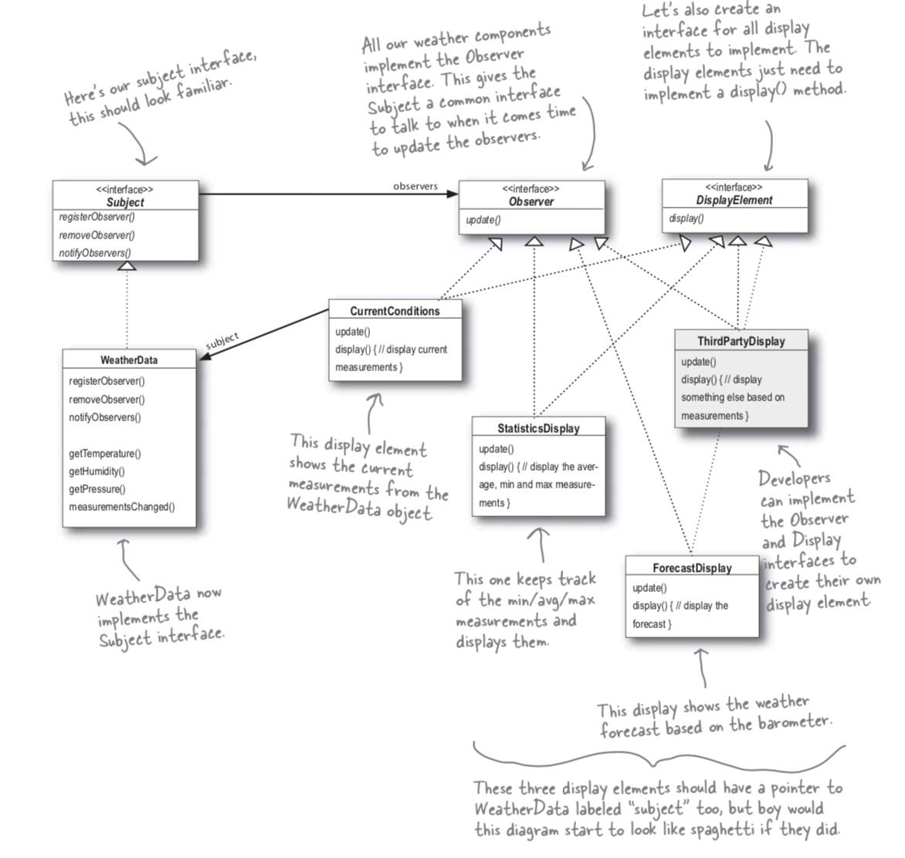

## The Observer Pattern
### Refference : Head First Design Pattern

If you want a pattern that keeps your objects in the know when something they might care about happens. The observer pattern is the one of the most heavily used pattern in the JDK.

### Definition

The Observer Pattern defines a one-to-many dependency between objects so that when one object changes state, all of its dependents are notified and updated automatically.

Further dependent objects and subscribe and unsubscribe too in run time.

There are a few different ways to implement the Observer Pattern but most revolve around a class design that includes Subject and Observer interface.


### One to many relationship
There is one Subject with the state. The Observer other hand , use the state, even if they don't own it.
There is a relationship between the ONE Subject to the MANY Observers. There are many observers and they rely on the Subject to tell them wen tits state changes.

### How does dependence come into this

Becouse the subject is the sole owner of that data, the observers are dependent on the subject to update them when the data changes. This leads to a cleaner OO design than allowing many objects to control the same data.

### Power of loosly coupling

When two objects are loosely coupled , they can interact, but have very little knowledge of each other. The observer Pattern provides an object design where subjects and observers are loosely coupled.

The only thing the subject knows about an observer is that it implements a certain interface (the Observer interface).

We can add new observers at any time becouse subject depends on is a list of ojbects that implement the Observer interface. we can add, remove and replace any observer in runtime.

We can reuse subjects or observers independently of each other.


## Example :
## The Weather Monitoring applicaiton overview

The three players in the system are the weather station (the physical device that acquires the actual weather data), the WeatherData object (that tracks the data comming from the Weather Station and updates the displayes), and the diplay that shows users the current weather conditions.


How do we apply Observer patter for our Whether station system.

Our WeatherData class is the "one" and our "many" is the various dispaly elements that use the weather measurements.

The WeatherData class certainly has state..that's the temperature, humidity and barometric pressure, and those definitely change.

When those measurements are change, we have to notify all the display elements so they can do whatever it is they are going to do with measurements.

If we make the WeatherData oibject the subject , and the display elements the observers, then the displays will register themselves with the WeatherData object in oder to get the informaiton they want.

Every display will have, say, an update() method that weatherData will call.





## Lets start coding

```
javac Subject.java 

javac Observer.java

javac DisplayElement.java

javac WeatherData.java

 javac CurrentConditionsDisplay.java

 javac WeatherStation.java

 java WeatherStation

 Result :

 Curent coditions : 80.0 F degree and  65.0 % humidity 
Curent coditions : 78.0 F degree and  90.0 % humidity

```