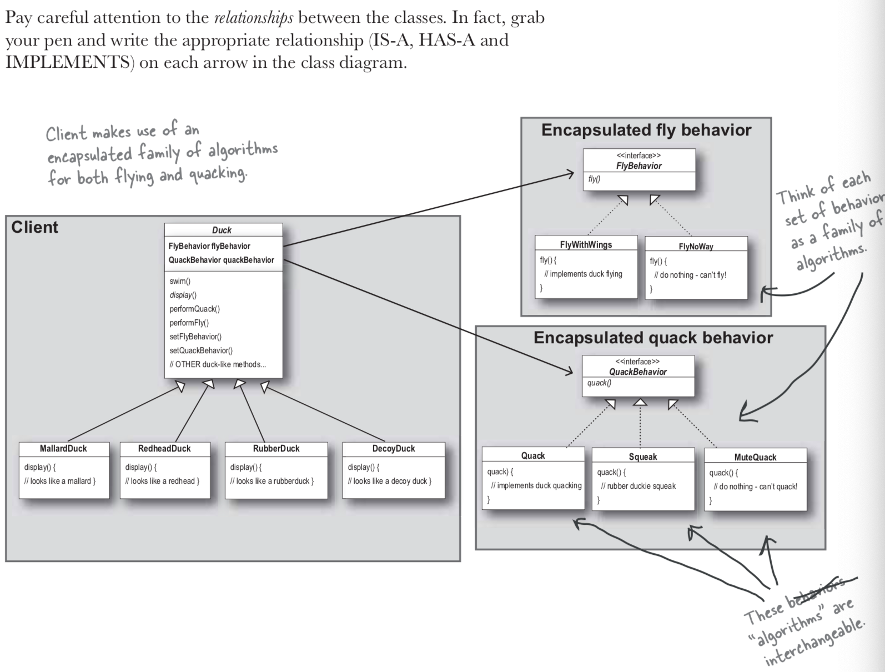
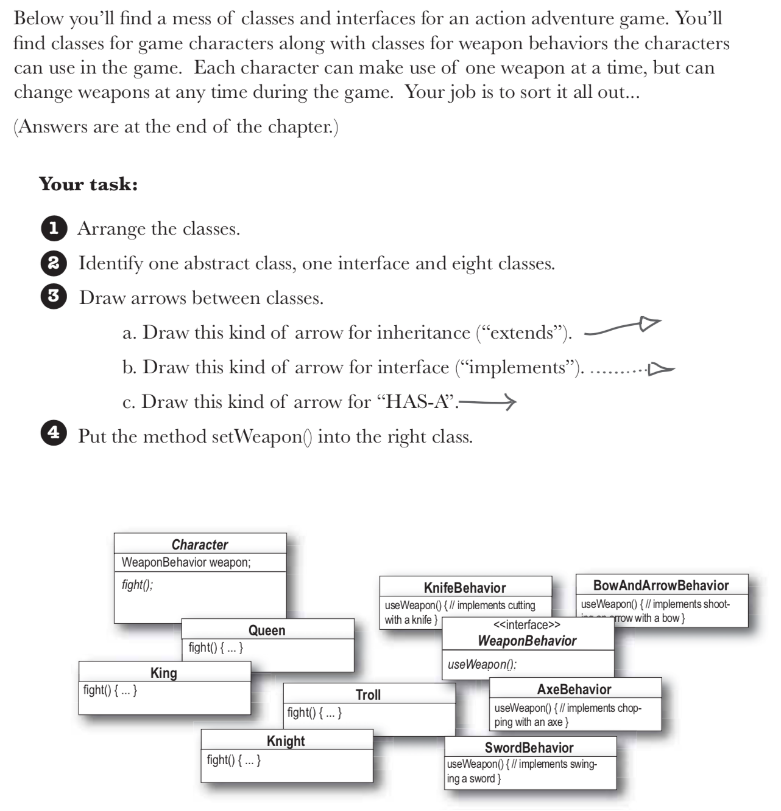

## The Strategy Pattern
### Refference : Headfirst Design Pattern

The Strategy Pattern defines a family of algorithms, encapsulates each one, and makes them interchangeable.

Strategy lets the algorithm vary independently from clients that use it.

strategy.png

### Compiling and using it

```
javac Duck.java

javac FlyNoWay.java

javac FlyWithWings.java

javac FlyNoWay.java

javac QuackBehavior.java

javac Quack.java

javac MuteQuack.java

javac Squeak.java

javac MiniDuckSimulator.java

java MiniDuckSimulator

// Checking the dynamic behaviour of the behavior

javac ModelDuck.java

javac FlyRocketPowered.java 

javac MiniDuckSimulator.java

java MiniDuckSimulator

```

## Overall Design
How we can use this pattern in real world senarios.
Think duck behaviours as a set of algorithms.
As a example differnt way of quacking or in practical different way of tax in defferent states.
The design pattern defines a family of algorithmes, encapsulates ech one, and make them interchangeable. Stragegy lets the algorithm vary independently from the clients that use it.




## HAS-A can be better than IS-A

The HAS-A relationship is an interesting one: each duck has a FlyBehavior and a QuackBehaviour to which it delegates flying and quacking.
When you put two classes together like this you are useing composition. Instead of inheriting their behaviour, the ducks get their behaviour by being composed with the right behaviour object.

This is a important technique; in fact.
As you've seen, creating system using composition gives you a lot more flexibility. Not only does it let you encapsulate a family of algorithms into their own set of classes, but it also lets you change behaviour at runtime as long as the object you're composing with implements the correct behaviour interface.

## Excersize

