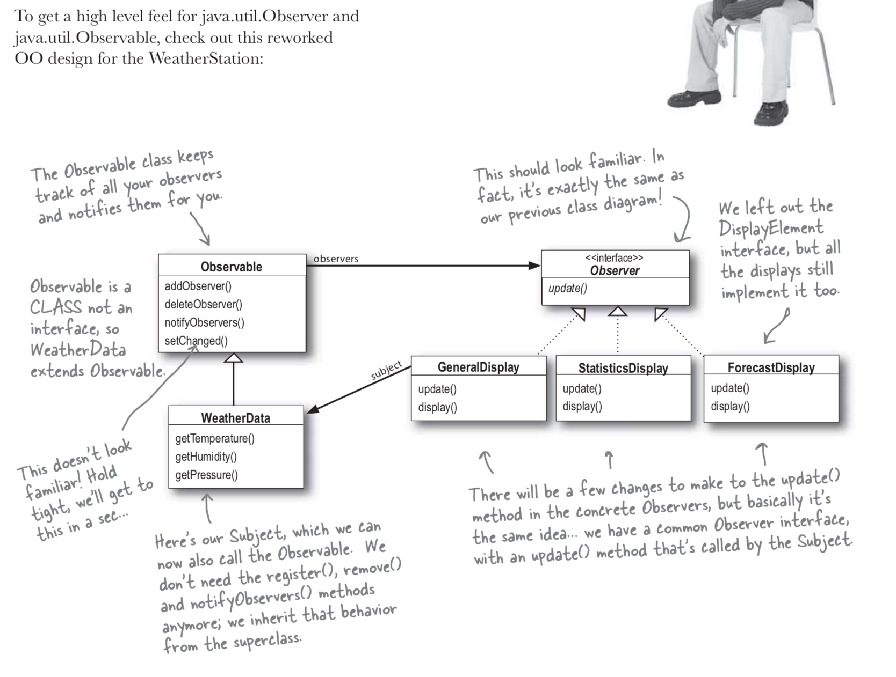

## Java has a built in Observer pattern 

We have talked lot of about Observer pattern
you may find it by bellow URL.


```
https://github.com/tharangar/java-for-interviews/blob/master/DesignPatterns/ObserverPattern/README.md
```

Lets discuss java util built in Observer pattern




The built in Observer Pattern works a bit differently than the implementation that we used on the weather Station. The most obvious difference is that WeatherData (our subject) now extends the Observable class and inherits the add, delete and notify Observer methods (among a few others). Here's how we use Java's version:

It implements the update method, as before , but the signature of the method is a bit different:

```update(Observer o, Object arg) ```


## Compile and Run the applicaiton

```
javac WeatherData.java

javac CurrentConditionsDisplay.java

javac DisplayElement.java 

javac WeatherStation.java 

java WeatherStation

```

